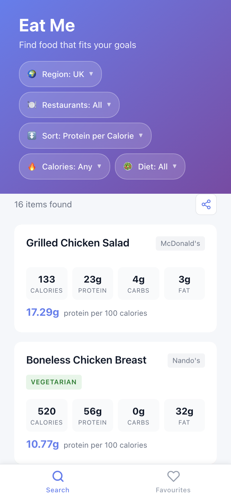

# Eat Me - the Smart Food Finder

Find food that fits your dietary goals when eating out on the UK high street.

## Business Problem

- **Where can I eat?** Find restaurants that satisfy your dietary requirements
- **What can I order?** Filter menu items by your personal goals:
  - Vegetarian/Vegan options
  - Calorie counting (set a calorie budget)
  - High protein foods
  - Protein per calorie optimization

## Features

- 🥗 Filter by vegetarian or vegan options
- 🔥 Set your calorie budget
- 💪 Find high-protein foods
- 📊 Sort by protein per calorie for optimal nutrition
- 🏪 Browse multiple restaurant chains
- 👈 Swipe left on a food item to hide it from the list
- ❤️ Swipe right on a food item to favourite it
- ⭐ Dedicated Favourites tab to view all your saved items
- 🙈 Hidden items counter with a "show all" link to restore them
- 💾 Hidden and favourite choices persist across sessions

## Screenshots

### Main Search View
The default view shows all food items sorted by protein per calorie, with filter pills, a results count, and the bottom app bar for navigating between Search and Favourites.



### Sort Options
Tap a sort pill (e.g. "Protein per Calorie") to open the sort tray and choose from 8 sorting options.


### Item Detail Modal
Tap any food card to open the full nutritional detail, allergens, ingredients, and sharing options.


### Favourites View
Tap the Favourites tab in the bottom bar to see your saved items. Swipe left on any favourite to remove it.


### Swipe to Hide / Favourite
On the main view, swipe a card left to hide it or right to favourite it. Hidden items are tracked in the header with a "show all" link to restore them.

## Project Structure

```
/raw/{region}/{restaurant}/{document.extension} - Original PDF menu documents
/data/index.json - List of available regions
/data/{region}/index.json - Restaurants in each region
/data/{region}/{restaurant}/food.json - Menu items per restaurant
/data/{region}/food.json - Merged menu items for the entire region
/src/react-app - React frontend application
/docs/components.md - React component documentation
/docs/screenshots/ - Screenshot assets used in documentation
```

### Further Documentation

- [Component Documentation](docs/components.md) — Props, state, behaviours, and screenshots for every React component

## Getting Started

### Prerequisites

- Node.js 20+

### Running Locally

```bash
cd src/react-app
npm install
npm run dev
```

### Running Tests

The project includes BDD-style end-to-end tests using Playwright:

```bash
cd src/react-app
npm install
npx playwright install --with-deps chromium
npm run test:e2e
```

To run tests with a UI:

```bash
npm run test:e2e:ui
```

## JSON Schema

Menu items conform to the schema defined in [schemas/food.json.md](schemas/food.json.md).

## Deployment

This application is deployed to GitHub Pages automatically when changes are pushed to the main branch.

### GitHub Pages Setup (Required)

For the deployment to work, GitHub Pages must be enabled in the repository settings:

1. Go to **Settings** → **Pages** in the repository
2. Under **Build and deployment**, set **Source** to **GitHub Actions**
3. Save the settings

Once configured, any push to the `main` branch will automatically build and deploy the React app to GitHub Pages.

### Troubleshooting

If the deploy job fails with `Error: Failed to create deployment (status: 404)`, ensure that:
- GitHub Pages is enabled with **Source** set to **GitHub Actions** (not "Deploy from a branch")
- The repository has the correct permissions set in the workflow (`pages: write`, `id-token: write`)

## License

MIT License
