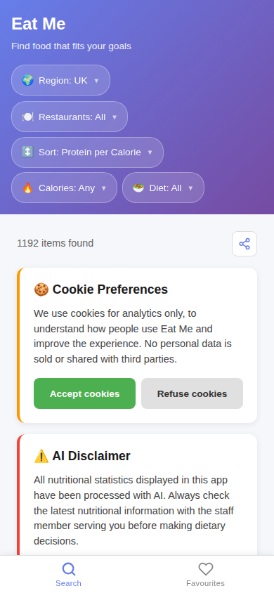
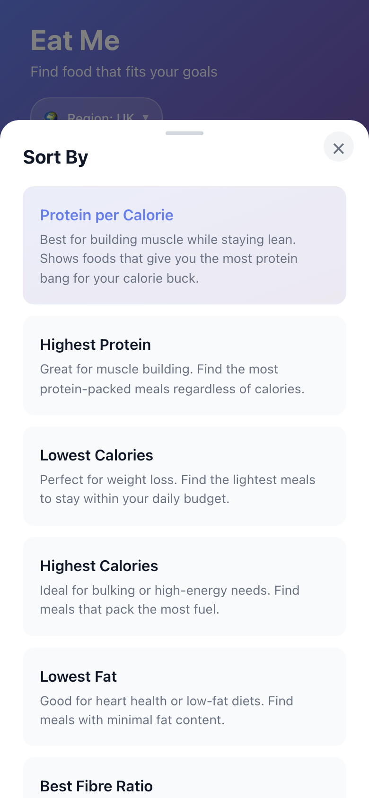
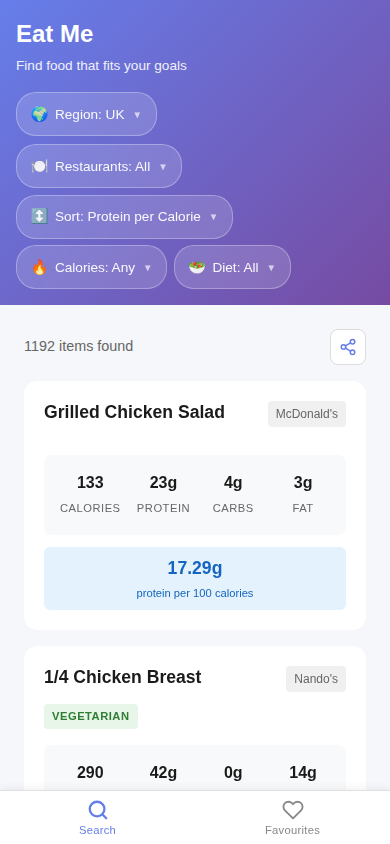
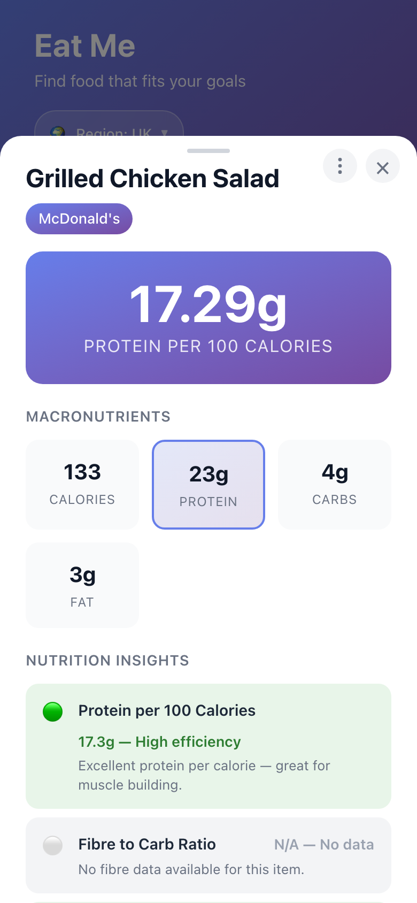
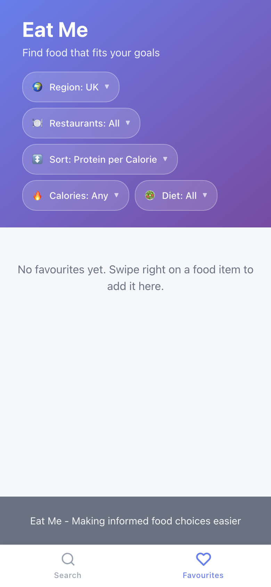

# Component Documentation

**Eat Me** is a mobile-first Progressive Web App that helps users find restaurant food items matching their dietary goals. Users can filter and sort foods by nutritional metrics, view detailed nutrition insights with traffic-light ratings, and save favourites for quick access.

This document covers every React component in the app, organised from the top-level layout down to individual UI primitives.

---

## Table of Contents

- [App Overview](#app-overview)
- [Component Hierarchy](#component-hierarchy)
- **Layout & Navigation**
  - [App](#app)
  - [HeaderPills](#headerpills)
  - [BottomAppBar](#bottomappbar)
- **Food Display**
  - [FoodList](#foodlist)
  - [FoodCard](#foodcard)
  - [FoodDetailModal](#fooddetailmodal)
  - [FoodItemContextMenu](#fooditemcontextmenu)
  - [FavouritesList](#favouriteslist)
- **Interactive Primitives**
  - [SwipeableCard](#swipeablecard)
  - [Pill](#pill)
  - [Tray](#tray)
- **Notice Cards**
  - [CookieConsentCard](#cookieconsentcard)
  - [DisclaimerCard](#disclaimercard)
- **Utility Components**
  - [SkeletonCard](#skeletoncard)
  - [ErrorBoundary](#errorboundary)
- [Perspectives System](#perspectives-system)
- [State Management & Data Flow](#state-management--data-flow)

---

## App Overview



The app is structured into three main visual areas:

1. **Header** — App title and a row of filter pills for region, restaurants, sort order, calorie range, and dietary preference.
2. **Main Content** — A scrollable grid of food cards (Search tab) or favourited items (Favourites tab). Includes notice cards for cookie consent and an AI disclaimer at the top.
3. **Bottom Navigation** — Tab bar switching between the Search and Favourites views.

---

## Component Hierarchy

```
App (root state manager)
├── <header> HeaderPills
│   ├── Pill × 5 (Region, Restaurants, Sort, Calories, Diet)
│   └── Tray × 5 (one modal drawer per filter)
├── <main>
│   ├── FoodList (Search tab)
│   │   ├── CookieConsentCard
│   │   ├── DisclaimerCard
│   │   ├── SwipeableCard × N
│   │   │   └── FoodCard
│   │   ├── FoodDetailModal
│   │   │   └── Tray
│   │   └── SkeletonCard × 6 (loading state)
│   └── FavouritesList (Favourites tab)
│       ├── SwipeableCard × N
│       │   └── FoodCard
│       └── FoodDetailModal
├── <footer>
└── BottomAppBar
```

`ErrorBoundary` wraps the entire `<App>` at the root in `main.tsx`.

---

## Layout & Navigation

### App

**File:** `src/react-app/src/App.tsx`

The root component. Manages all application state, data fetching, filtering logic, and renders the top-level layout.

#### State

| State | Type | Description |
|-------|------|-------------|
| `regions` | `Region[]` | Available geographic regions |
| `selectedRegion` | `string \| null` | Active region (defaults to `"uk"`) |
| `restaurants` | `Restaurant[]` | Restaurants in the selected region |
| `foodItems` | `FoodItem[]` | All food items for the region |
| `filters` | `FilterOptions` | Active dietary/calorie/sort/restaurant filters |
| `cookieConsent` | `boolean \| null` | GDPR consent status |
| `disclaimerDismissed` | `boolean` | Whether the AI disclaimer has been dismissed today |
| `hiddenItems` | `Set<string>` | Items hidden by the user (persisted in localStorage) |
| `favouriteItems` | `Set<string>` | User's favourite items (persisted in localStorage) |
| `activeTab` | `'search' \| 'favourites'` | Current navigation tab |
| `isLoading` | `boolean` | Data loading indicator |
| `error` | `string \| null` | Error message, if any |
| `pullDistance` | `number` | Pull-to-refresh gesture distance |

#### Key Behaviours

- **Pull-to-refresh**: Custom touch handler (100px threshold) clears the service worker cache and reloads. Uses a native `addEventListener` with `{ passive: false }` because React 19 registers passive touch listeners by default.
- **URL state sync**: Filters are encoded in URL query parameters so users can share links with filters pre-applied.
- **Deep linking**: An `?item=Name&itemRestaurant=Restaurant` URL opens the detail modal for a specific food item.
- **Filtering & sorting**: A `useMemo` computes `filteredItems` from `foodItems` + `filters`. Supports 8 sort options and dietary/calorie constraints.

#### Renders

`HeaderPills`, `FoodList` or `FavouritesList` (based on `activeTab`), `BottomAppBar`, and a footer.

---

### HeaderPills

**File:** `src/react-app/src/components/HeaderPills.tsx`

Renders a horizontal row of filter pill buttons in the app header. Each pill opens a corresponding Tray modal with filter controls.



#### Props

| Prop | Type | Description |
|------|------|-------------|
| `regions` | `Region[]` | Available regions for the region picker |
| `selectedRegion` | `string \| null` | Currently active region |
| `onRegionChange` | `(regionId: string \| null) => void` | Callback when region changes |
| `restaurants` | `Restaurant[]` | Restaurants for the restaurant filter |
| `filters` | `FilterOptions` | Current filter state |
| `onFiltersChange` | `(filters: FilterOptions) => void` | Callback when any filter changes |
| `isLoading` | `boolean` | Disables interactions while loading |

#### State

| State | Type | Description |
|-------|------|-------------|
| `activeTrays` | `object` | Tracks which tray (modal) is currently open |
| `calorieInput` | `string` | Form input for max calorie value |
| `minCalorieInput` | `string` | Form input for min calorie value |

#### Filter Trays

| Tray | Controls | Description |
|------|----------|-------------|
| **Region** | Dropdown select | Pick from available regions |
| **Type** | Radio buttons | Food (default) / Drinks — filters items by their `type` field |
| **Restaurants** | Multi-select checkboxes | Filter by one or more restaurants |
| **Sort** | Radio buttons | 8 sort options (protein, calories, fat, salt, fibre-to-carb, name) |
| **Calories** | Quick-select buttons + custom range | Preset calorie caps (100–1200) or custom min/max |
| **Diet** | Radio buttons | All / Vegetarian / Vegan |

---

### BottomAppBar

**File:** `src/react-app/src/components/BottomAppBar.tsx`

Fixed bottom navigation bar providing tab switching between Search and Favourites views.

#### Props

| Prop | Type | Description |
|------|------|-------------|
| `activeTab` | `'search' \| 'favourites'` | Currently active tab |
| `onTabChange` | `(tab: AppTab) => void` | Callback when tab is tapped |
| `favouriteCount` | `number` | Badge count shown on the Favourites tab |

#### Behaviour

- Uses SVG icons for Search (magnifying glass) and Favourites (heart).
- Active tab is highlighted in blue.
- Tapping the Search tab scrolls the page to the top with a smooth animation.
- Favourites tab shows a count badge when `favouriteCount > 0`.
- Respects `env(safe-area-inset-bottom)` for notched devices.
- Minimum 48px touch targets for accessibility.

---

## Food Display

### FoodList

**File:** `src/react-app/src/components/FoodList.tsx`

The primary content view for the Search tab. Renders food items in a responsive CSS grid with notice cards, share functionality, and a hidden-items counter.



#### Props

| Prop | Type | Description |
|------|------|-------------|
| `items` | `FoodItem[]` | Filtered and sorted food items |
| `sortBy` | `SortOption` | Current sort option (affects card display) |
| `filters` | `FilterOptions` | Current filters (used for sharing) |
| `isLoading` | `boolean` | Shows skeleton cards when true |
| `error` | `string \| null` | Displays error message |
| `initialItem` | `{ name: string; restaurant?: string } \| null` | Deep-linked item to auto-open |
| `onClearInitialItem` | `() => void` | Clears deep-link after consumption |
| `showCookieConsent` | `boolean` | Whether to show the GDPR banner |
| `onCookieAccept` | `() => void` | Cookie accept callback |
| `onCookieRefuse` | `() => void` | Cookie refuse callback |
| `showDisclaimer` | `boolean` | Whether to show the AI disclaimer |
| `onDisclaimerDismiss` | `() => void` | Disclaimer dismiss callback |
| `hiddenItems` | `Set<string>` | Set of hidden item keys |
| `favouriteItems` | `Set<string>` | Set of favourite item keys (also hidden from search) |
| `onHideItem` | `(item: FoodItem) => void` | Hide callback (swipe left) |
| `onFavouriteItem` | `(item: FoodItem) => void` | Favourite callback (swipe right, also hides from search) |
| `onShowAll` | `() => void` | Resets all hidden and favourited items |
| `onHideRestaurant` | `(restaurant: string) => void` | Callback to filter out all items from a restaurant (via context menu) |
| `onOnlyShowRestaurant` | `(restaurant: string) => void` | Callback to show only items from a restaurant (via context menu) |

#### State

| State | Type | Description |
|-------|------|-------------|
| `selectedItem` | `FoodItem \| null` | Item currently shown in the detail modal |
| `showToast` | `boolean` | Toast notification visibility for share feedback |
| `initialItemConsumed` | `boolean` | Whether the deep-linked item has been auto-opened |
| `displayCount` | `number` | Number of items currently rendered (progressive rendering) |

#### Key Behaviours

- **Progressive rendering**: Items load in batches of 6. An `IntersectionObserver` on a sentinel element at the bottom of the grid loads the next batch when the user scrolls near it.
- **Favourite hides from search**: Favourited items are filtered out of the search view (they appear in the Favourites tab instead). Swiping right animates the card off-screen.
- **Loading state**: Renders 6 `SkeletonCard` placeholders with shimmer animation.
- **Grid layout**: CSS Grid with `auto-fill`, minimum column width of 280px.
- **Share button**: Copies current filter URL to clipboard or opens the native share dialog.
- **Long press to share**: Long-pressing a food card (500ms) triggers the Web Share API or copies the item's share URL to clipboard.
- **URL reflects selected item**: When a food item is clicked the browser URL is updated with `item` and `itemRestaurant` query params so the URL can be copied and pasted directly. Closing the detail modal restores the filter-only URL.
- **Hidden items counter**: Shows a "Show all" button with count of hidden items (includes both swiped-left and favourited items). Clicking "Show all" resets both hidden and favourite lists.
- **Toast notification**: 2-second notification after sharing.
- **Deep linking**: Auto-opens `FoodDetailModal` if `initialItem` matches a loaded item.

---

### FoodCard

**File:** `src/react-app/src/components/FoodCard.tsx`

Displays a single food item as a card with nutrition summary. The displayed metrics adapt based on the current sort option.

#### Props

| Prop | Type | Description |
|------|------|-------------|
| `item` | `FoodItem` | The food item data |
| `sortBy` | `SortOption` | Current sort — determines which metric is highlighted |
| `onClick` | `() => void` | Opens the detail modal |
| `isFavourite` | `boolean` | Shows a favourite indicator (❤️) and pink border |

#### Display Sections

| Section | Content |
|---------|---------|
| **Header** | Food name, restaurant tag, favourite heart |
| **Badges** | Vegetarian / Vegan labels (if applicable) |
| **Nutrition grid** | Calories, Protein, Carbs, Fat |
| **Dynamic metric** | Changes based on `sortBy` — e.g. "Protein per 100cal", "Carb-to-fibre ratio", "Salt per serving" |
| **Ingredients** | Count of ingredients |

#### Sort-Dependent Highlighting

| Sort Option | Highlighted Metric |
|-------------|-------------------|
| `protein-per-calorie-desc` | Protein per 100 calories |
| `fibre-to-carb-asc` | Carb-to-fibre ratio with quality label |
| `salt-asc` | Salt per serving |
| Default | Standard 4-column nutrition grid |

---

### FoodDetailModal

**File:** `src/react-app/src/components/FoodDetailModal.tsx`

Full-detail view of a food item, rendered inside a `Tray` modal. Shows comprehensive nutrition data, traffic-light perspective ratings, allergens, and ingredients.



#### Props

| Prop | Type | Description |
|------|------|-------------|
| `item` | `FoodItem \| null` | The food item to display (null = closed) |
| `sortBy` | `SortOption` | Current sort option (highlights primary metric) |
| `filters` | `FilterOptions` | Current filters (used when sharing the item) |
| `onClose` | `() => void` | Close callback |
| `onHideRestaurant` | `(restaurant: string) => void` | Callback to filter out all items from a restaurant |
| `onOnlyShowRestaurant` | `(restaurant: string) => void` | Callback to show only items from a restaurant |

#### Display Sections

1. **Header** — Item name, restaurant
2. **Top-right actions** — Context menu (⋮ button) and close button (×), styled consistently side by side
2. **Dietary badges** — Vegetarian / Vegan
3. **Primary metric** — Dynamic based on `sortBy` (highlights the user's focus area)
4. **Macronutrients grid** — All 8 macros: calories, protein, carbohydrates, fat, saturated fat, sugar, fibre, salt
5. **Nutrition Insights** — 4 traffic-light perspective ratings (see [Perspectives System](#perspectives-system))
6. **Allergens** — List of allergens present in the item
7. **Ingredients** — Full ingredient list

#### Key Behaviours

- **Context menu**: A ⋮ (vertical dots) button opens a dropdown menu with Share, Hide all [restaurant], and Only show [restaurant] actions.
- **Share**: Generates a deep-link URL with `?item=Name&itemRestaurant=Restaurant` plus current filters (accessed via context menu).
- **Hide all [restaurant]**: Closes the modal and updates the restaurant filter to exclude the current item's restaurant.
- **Only show [restaurant]**: Closes the modal and updates the restaurant filter to show only the current item's restaurant.
- **Toast notification**: 2-second feedback after sharing.
- Renders inside a `Tray` component (swipe-down or Escape to close).

---

### FoodItemContextMenu

**File:** `src/react-app/src/components/FoodItemContextMenu.tsx`

A dropdown context menu rendered in the `Tray` header area, next to the close button. Replaces the standalone share button with a ⋮ (vertical dots) trigger that opens a menu with contextual actions. The trigger is styled to match the close button (circular, grey background) for visual consistency.

#### Props

| Prop | Type | Description |
|------|------|-------------|
| `restaurantName` | `string \| undefined` | Restaurant name for the current item (hides restaurant actions when absent) |
| `onShare` | `() => void` | Share callback |
| `onHideRestaurant` | `(restaurant: string) => void` | Callback to exclude a restaurant from results |
| `onOnlyShowRestaurant` | `(restaurant: string) => void` | Callback to show only a restaurant's items |

#### Menu Actions

| Action | Description |
|--------|-------------|
| **Share** | Always visible. Triggers the share callback (copies link or opens native share dialog) |
| **Hide all [restaurant]** | Visible when item has a restaurant. Filters out all items from that restaurant |
| **Only show [restaurant]** | Visible when item has a restaurant. Filters to show only that restaurant's items |

#### Key Behaviours

- **Open/close toggle**: Clicking the ⋮ trigger toggles the menu open/closed.
- **Click outside to close**: Menu closes when clicking anywhere outside the menu wrapper.
- **Actions close menu**: Each action closes the menu after executing its callback.
- **Accessible**: Uses `role="menu"` and `role="menuitem"` for screen readers, `aria-expanded` on the trigger.
- **Animated entrance**: Menu slides in with a subtle opacity/scale animation.

---

### LongPressContextMenu

**File:** `src/react-app/src/components/LongPressContextMenu.tsx`

A fullscreen overlay context menu that appears when the user long-presses or right-clicks a food item in the list view. Provides the same actions as `FoodItemContextMenu` (Share, Hide all [restaurant], Only show [restaurant]) plus item-level Favourite and Hide actions, without needing to open the detail modal first.

#### Props

| Prop | Type | Description |
|------|------|-------------|
| `item` | `FoodItem` | The food item that was long-pressed or right-clicked |
| `onShare` | `() => void` | Share callback |
| `onHideItem` | `() => void \| undefined` | Callback to hide the item from the list |
| `onFavouriteItem` | `() => void \| undefined` | Callback to favourite the item |
| `onHideRestaurant` | `(restaurant: string) => void \| undefined` | Callback to exclude a restaurant from results |
| `onOnlyShowRestaurant` | `(restaurant: string) => void \| undefined` | Callback to show only a restaurant's items |
| `onClose` | `() => void` | Callback to close the overlay |

#### Key Behaviours

- **Overlay backdrop**: Renders a semi-transparent backdrop over the entire screen with the menu centred.
- **Tap outside to close**: Tapping the backdrop (outside the menu) closes the overlay.
- **Escape to close**: Pressing the Escape key closes the overlay.
- **Item name header**: Displays the long-pressed item's name at the top of the menu.
- **Triggered by long press or right click**: Both gestures open the same menu on a food card in the list view.
- **Menu actions**: Share, Favourite, Hide, Hide all [restaurant], and Only show [restaurant] (restaurant actions only visible when item has a restaurant).
- **Animated entrance**: Overlay fades in, menu scales in with a subtle animation.

---

### FavouritesList

**File:** `src/react-app/src/components/FavouritesList.tsx`

Favourites tab content — displays only items the user has marked as favourites. Uses the same card grid and detail modal as `FoodList`.



#### Props

| Prop | Type | Description |
|------|------|-------------|
| `allItems` | `FoodItem[]` | All food items (filtered by `favouriteItems` internally) |
| `favouriteItems` | `Set<string>` | Set of favourite item keys |
| `sortBy` | `SortOption` | Current sort option |
| `filters` | `FilterOptions` | Current filters (for sharing) |
| `onUnfavourite` | `(item: FoodItem) => void` | Remove-from-favourites callback |
| `onClearAll` | `() => void` | Clears all favourites |

#### State

| State | Type | Description |
|-------|------|-------------|
| `selectedItem` | `FoodItem \| null` | Item shown in the detail modal |

#### Key Behaviours

- Filters `allItems` to only those in the `favouriteItems` set.
- Swipe left on a card to unfavourite (❤️ → 💔 Remove).
- **Clear all button**: Removes all favourites at once.
- Shows an empty state message when no items are favourited: *"No favourites yet. Swipe right on a food item to add it here."*
- Opens the same `FoodDetailModal` on card tap.

---

## Interactive Primitives

### SwipeableCard

**File:** `src/react-app/src/components/SwipeableCard.tsx`

A gesture wrapper that adds horizontal swipe actions to any child content (primarily wraps `FoodCard`). Provides left and right swipe with visual feedback and fly-off animation.

#### Props

| Prop | Type | Description |
|------|------|-------------|
| `children` | `ReactNode` | Card content to wrap |
| `onSwipeLeft` | `() => void` | Left swipe callback (e.g. hide item) |
| `onSwipeRight` | `() => void` | Right swipe callback (e.g. favourite item) |
| `onLongPress` | `() => void` | Long press callback (e.g. open context menu) |
| `leftLabel` | `string` | Label shown behind the card on right swipe (e.g. "❤️ Favourite") |
| `rightLabel` | `string` | Label shown behind the card on left swipe (e.g. "🙈 Hide") |
| `animateOutLeft` | `boolean` | Whether to fly the card off-screen left after action |
| `animateOutRight` | `boolean` | Whether to fly the card off-screen right after action |
| `onContextMenu` | `() => void` | Right-click callback (e.g. open context menu) |

#### Gesture Logic

| Parameter | Value | Description |
|-----------|-------|-------------|
| Swipe threshold | 80px | Minimum horizontal distance to trigger an action |
| Opacity fade distance | 400px | Card fades to transparent over this distance |
| Fly-off duration | 300ms | Animation duration when card exits screen |
| Vertical lock | 10px | If vertical movement exceeds this before horizontal exceeds 10px, the gesture is treated as a scroll |
| Long press duration | 500ms | Hold time to trigger the long press callback |
| Long press move tolerance | 10px | Movement beyond this cancels the long press |

#### State

| State | Type | Description |
|-------|------|-------------|
| `offsetX` | `number` | Current horizontal drag offset |
| `isDragging` | `boolean` | Whether a drag gesture is active |
| `animatingOut` | `'left' \| 'right' \| null` | Direction of fly-off animation |

#### Key Behaviours

- Background indicators reveal the action label as the card is swiped.
- Snaps back with animation if the threshold is not met.
- Long press (500ms hold without moving) triggers the `onLongPress` callback and suppresses the subsequent click/swipe.
- Right click triggers the `onContextMenu` callback and suppresses the browser's default context menu.
- Prevents app-level touch handlers (stops pull-to-refresh during swipe).
- Cleans up pending animation timers on unmount.

---

### Pill

**File:** `src/react-app/src/components/Pill.tsx`

A compact filter button with a label, current value, and dropdown chevron. Used by `HeaderPills` for each filter category.

#### Props

| Prop | Type | Description |
|------|------|-------------|
| `label` | `string` | Filter name (e.g. "Sort", "Diet") |
| `value` | `string` | Current filter value (e.g. "Protein per Calorie") |
| `onClick` | `() => void` | Opens the corresponding filter tray |
| `isActive` | `boolean` | Visual highlight when tray is open |
| `icon` | `string` | Emoji icon (e.g. "🔥", "🥗") |

#### Styling

- Rounded capsule shape with the app's gradient on active state.
- Displays `icon + label: value + ▼`.
- Minimum 44px touch target.
- Hover effects wrapped in `@media (hover: hover)` to prevent sticky hover on touch devices.

---

### Tray

**File:** `src/react-app/src/components/Tray.tsx`

A modal drawer component used for filter panels and the food detail modal. Appears as a bottom sheet on mobile and a centred dialog on larger screens.

#### Props

| Prop | Type | Description |
|------|------|-------------|
| `isOpen` | `boolean` | Controls visibility |
| `onClose` | `() => void` | Close callback |
| `title` | `string` | Optional title shown in the tray header |
| `headerActions` | `ReactNode` | Optional extra buttons rendered next to the close button in the top-right corner |
| `children` | `ReactNode` | Tray content |

#### State

| State | Type | Description |
|-------|------|-------------|
| `dragOffset` | `number` | Current swipe-down drag distance |
| `isDragging` | `boolean` | Whether a drag-to-close gesture is active |

#### Key Behaviours

- **Swipe-down to close**: 100px threshold, max 300px drag distance.
- **Escape key**: Closes the tray.
- **Backdrop click**: Closes the tray.
- **Body scroll lock**: Prevents background scrolling when open.
- **Pull-to-refresh suppression**: Sets `document.body.dataset.trayOpen = 'true'` to disable pull-to-refresh while open.
- **Drag handle**: Visual pill-shaped indicator at the top of the sheet.
- **Close button**: × button in the top-right corner.
- **Responsive**: Bottom sheet on mobile (slides up from bottom), centred modal on desktop.

---

## Notice Cards

### CookieConsentCard

**File:** `src/react-app/src/components/CookieConsentCard.tsx`

GDPR cookie consent banner displayed at the top of the food grid on first visit. Explains that cookies are used for analytics only.

#### Props

| Prop | Type | Description |
|------|------|-------------|
| `onAccept` | `() => void` | User accepts analytics cookies |
| `onRefuse` | `() => void` | User refuses analytics cookies |

#### Behaviour

- Displays a 🍪 Cookie Preferences heading with explanation text.
- Two action buttons: **Accept cookies** / **Refuse cookies**.
- Choice is persisted in localStorage (`eatme-cookie-consent`).
- When accepted, Firebase Analytics consent is enabled.

---

### DisclaimerCard

**File:** `src/react-app/src/components/DisclaimerCard.tsx`

AI disclaimer banner shown once per day. Warns that nutritional statistics are AI-processed and may not be fully accurate.

#### Props

| Prop | Type | Description |
|------|------|-------------|
| `onDismiss` | `() => void` | User acknowledges the disclaimer |

#### Behaviour

- Displays a ⚠️ AI Disclaimer heading with warning text.
- Single **Got it, dismiss** button.
- Dismissal date stored in localStorage (`eatme-disclaimer-dismissed`).
- Resets each day at local midnight — shown again the next day.

---

## Utility Components

### SkeletonCard

**File:** `src/react-app/src/components/SkeletonCard.tsx`

Loading placeholder that mimics the layout of a `FoodCard`. Shown while food data is being fetched.

#### Props

None.

#### Behaviour

- Renders grey placeholder elements matching the FoodCard structure (title, badges, nutrition grid).
- Shimmer animation via CSS (`@keyframes shimmer`) for visual loading feedback.
- 6 skeleton cards are displayed during the loading state in `FoodList`.

---

### ErrorBoundary

**File:** `src/react-app/src/components/ErrorBoundary.tsx`

A React class component that catches rendering errors in the component tree and displays a fallback error UI.

#### State

| State | Type | Description |
|-------|------|-------------|
| `hasError` | `boolean` | Whether an error has been caught |

#### Behaviour

- Uses `getDerivedStateFromError()` to catch errors during rendering.
- Logs error details via `componentDidCatch()`.
- Displays an error message with a **Refresh** button that clears the service worker cache and hard-reloads the page.
- Wraps the entire `<App>` in `main.tsx`.

---

## Perspectives System

The perspectives system provides **traffic-light nutrition insights** for each food item. Four perspectives are defined, each evaluating a nutritional aspect and returning a green / amber / red / grey rating.

**Location:** `src/react-app/src/perspectives/`

### Perspective Interface

Each perspective implements:

```typescript
interface Perspective {
  id: string            // Unique identifier
  name: string          // Display name
  why: string           // Explanation of why this metric matters
  evaluate: (item: FoodItem) => PerspectiveResult  // Traffic-light rating
  sort: (a: FoodItem, b: FoodItem) => number       // Comparator for sorting
}

interface PerspectiveResult {
  rating: 'green' | 'amber' | 'red' | 'grey'  // Traffic light colour
  value: string                                  // Formatted display value
  label: string                                  // Short description
}
```

### Available Perspectives

| Perspective | File | Green | Amber | Red | Grey |
|-------------|------|-------|-------|-----|------|
| **Protein per 100 Calories** | `proteinEfficiency.ts` | ≥ 15g | 8–15g | < 8g | Missing data |
| **Fibre to Carb Ratio** | `fibreToCarb.ts` | ≤ 5:1 | 5–10:1 | > 10:1 | No fibre data |
| **Fat Content** | `fatContent.ts` | ≤ 3g per 100cal | 3–6g | > 6g | Missing data |
| **Salt Content** | `saltContent.ts` | ≤ 0.3g/serving | 0.3–1.5g | > 1.5g | No salt data |

### How Perspectives Are Used

1. `allPerspectives` array in `perspectives/index.ts` collects all four perspectives.
2. `FoodDetailModal` calls `evaluateAll(item)` to get ratings for the selected food item.
3. Results are rendered as traffic-light rows — coloured circles with value and label.
4. Each perspective also provides a `sort` function used when the corresponding sort option is active in `HeaderPills`.

---

## State Management & Data Flow

### Architecture

The app uses a **lifted state** pattern — all shared state lives in `App.tsx` and is passed down via props. There is no external state management library.

```
App.tsx (single source of truth)
  ├── URL params ↔ filters (two-way sync)
  ├── localStorage ↔ hidden/favourite items (two-way sync)
  ├── localStorage ← cookie consent / disclaimer state
  └── Firebase Analytics ← user actions (gated by consent)
```

### Persistence

| Data | Storage | Key |
|------|---------|-----|
| Hidden items | localStorage | `eatme-hidden-items` |
| Favourite items | localStorage | `eatme-favourite-items` |
| Cookie consent | localStorage | `eatme-cookie-consent` |
| Disclaimer dismissed | localStorage | `eatme-disclaimer-dismissed` |
| Filter state | URL query parameters | `sort`, `diet`, `minCal`, `maxCal`, `restaurants` |
| Deep-linked item | URL query parameters | `item`, `itemRestaurant` |

### Data Fetching Flow

```
App mounts
  → fetchRegions()           → sets regions[]
  → fetchRestaurants(region) → sets restaurants[]
  → fetchRegionFood(region)  → sets foodItems[]
    → useMemo: filteredItems = sort + filter foodItems
      → FoodList / FavouritesList renders cards
```

### Example: User Interaction Flow

**User swipes right on a food card (favourite):**

1. `SwipeableCard` detects 80px+ rightward swipe → calls `onSwipeRight`
2. `FoodList` calls `onFavouriteItem(item)` (passed from `App`)
3. `App` adds item key to `favouriteItems` Set
4. `saveFavouriteItems()` persists to localStorage
5. `SwipeableCard` flies off-screen (300ms animation)
6. `BottomAppBar` badge updates with new count
7. Item now appears in the Favourites tab

**User shares current filters:**

1. User taps the share button in `FoodList`
2. `shareFilters(filters)` from `urlState.ts` builds a URL with encoded filter params
3. If Web Share API is available → native share dialog; otherwise → clipboard copy
4. Analytics event is tracked (if consent given)
5. Toast notification appears for 2 seconds
